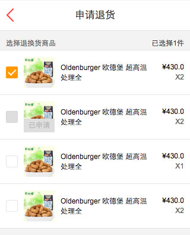

# （二）从简单页面入手

## 本节课目标

从PC布局入手，逐渐学习更多的移动端布局思路。

## 本节课涉及知识点

* `img{max-width:100%;}`防止图片撑开父容器
* Flexbox布局
* CSS3兼容性

## PC缩小版＝移动端

刚开始做移动端页面有可能无从下手，既然我们都做过PC页面，那么可以把PC页面的思路放到移动端页面上。

PC页面大部分是固定宽，或者设置几个卡点固定宽（小部分百分比），因为手机屏幕最小宽度为320，那么可以直接把移动端网页设置成320宽度。

[固定宽度布局](https://ximan.github.io/mobile-lesson/lesson02/01_fixed_width.html)

* `img{max-width:100%;}`防止图片撑开父容器
* BFC做左图固定，右文自适应
* 外层宽度部分100%，部分320px固定，并且居中

大家可以看看上面示例没有一句CSS3，一样能搞定普通的需求，并且兼容所有手机。唯一缺陷是非自适应，不过这并不重要，PC里大部分页面不也都没自适应么？

## 自适应网页布局

下面通过CSS3的Flexbox布局，加百分比布局，来实现完全的自适应布局。

[固定宽度布局](https://ximan.github.io/mobile-lesson/lesson02/02_flexible.html)

* Flexbox布局，自适应和居中
* 百分比控制宽高和内外边距

## 其他常见布局示例

[固定布局、流动布局、浮动布局、Flexbox布局、混合布局](http://ons.me/wp-content/uploads/2014/04/layout.html)

## CSS3兼容性

上一节课讲到HTML5+CSS3就提到[具体兼容性查询](http://caniuse.com/)。Flexbox属于CSS3里最复杂的兼容性属性了，为了方便学习，我之前总结果一个[Flexbox生成工具](http://ons.me/wp-content/uploads/2014/04/flexbox.html)便于大家理解Flexbox的兼容性写法。

另外如果用Less/Sass就更方便了，[Less Mixins & Sass Mixin](https://github.com/ximan/mix)里直接把Flexbox的mixin都总结好了，直接调用。

Less：`.display(flex)`，Sass：`@include display(flex)`

即可自动生成兼容性代码：

```
display: -webkit-box;
display: -webkit-flex;
display: -ms-flexbox;
display: flex;
```

如果你项目里在用grunt、gulp等构建工具，可以试试[Autoprefixer](https://github.com/postcss/autoprefixer)等自动添加CSS前缀的工具。

## 扩展阅读

[移动端网页制作入门之三：手机布局之美](http://ons.me/480.html)、
[一个完整的Flexbox指南](http://www.w3cplus.com/css3/a-guide-to-flexbox-new.html)、
[模块、图片、背景图片、视频等响应式（宽高等比缩放）布局](http://ons.me/493.html)

## 课下作业

请按照下图设计稿写出页面。

